# The Wild Oasis — Hotel Management App

A full-stack admin dashboard for managing a hotel/cabin resort. Handles the complete guest lifecycle: booking, check-in, room service, checkout, invoicing, and email notifications. Built for internal staff use. Fully responsive — works on desktop, tablet, and mobile.

**Live demo:** [https://thewildoasis-restoran.netlify.app](https://thewildoasis-restoran.netlify.app)

---

## Screenshots

<div align="center">
  <table>
    <tr>
      <td align="center"><b>Login Page</b></td>
      <td align="center"><b>Dashboard</b></td>
      <td align="center"><b>Bookings</b></td>
    </tr>
    <tr>
      <td>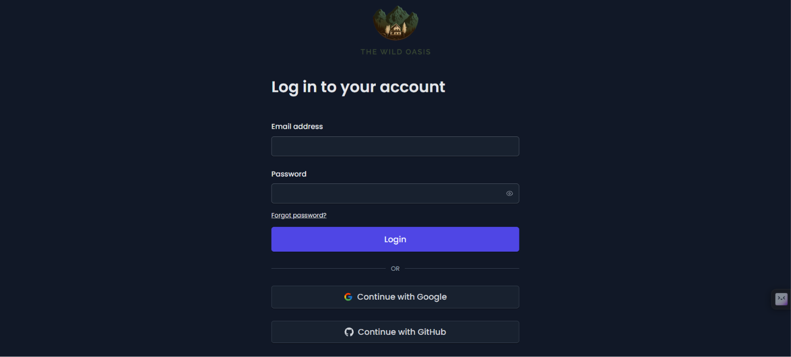</td>
      <td>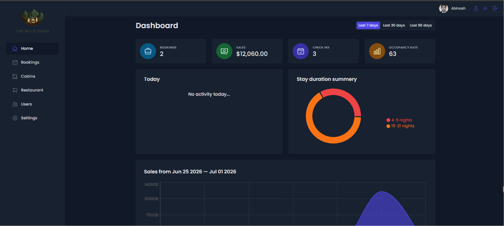</td>
      <td>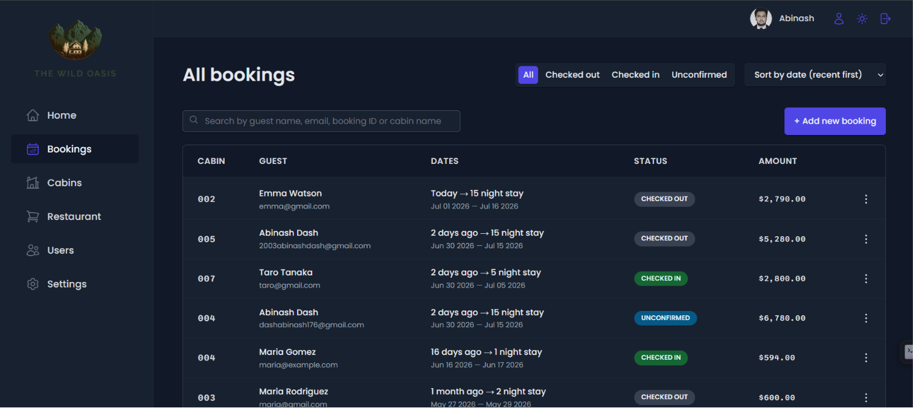</td>
    </tr>
    <tr>
      <td align="center"><b>Cabins</b></td>
      <td align="center"><b>Restaurant Orders</b></td>
      <td align="center"><b>Create User</b></td>
    </tr>
    <tr>
      <td>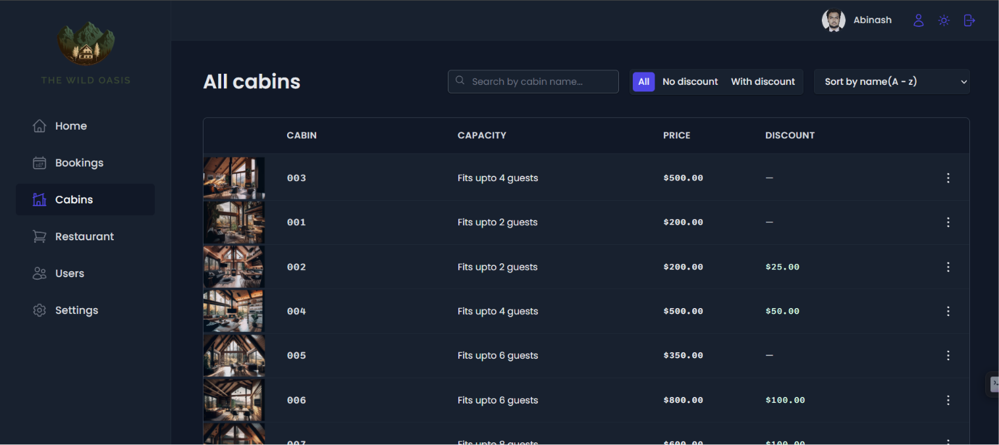</td>
      <td>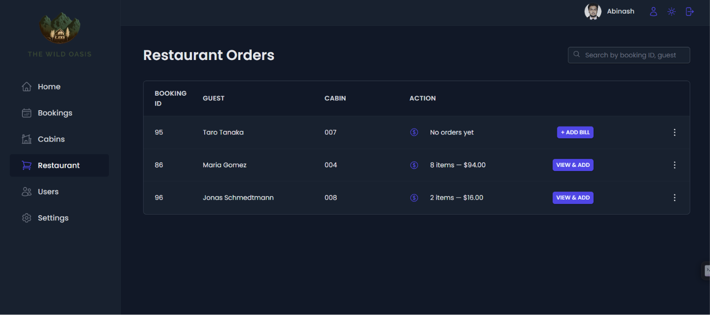</td>
      <td>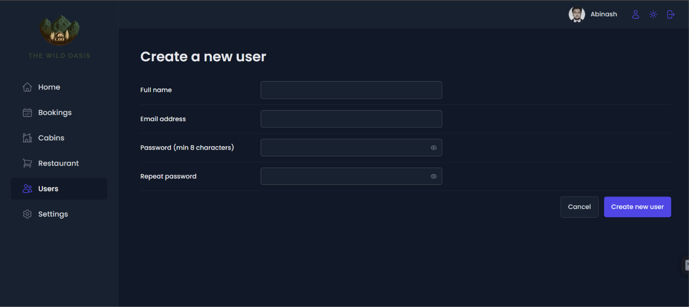</td>
    </tr>
    <tr>
      <td align="center"><b>Update Account</b></td>
      <td align="center"><b>Hotel Settings</b></td>
      <td align="center"><b>Booking Details</b></td>
    </tr>
    <tr>
      <td>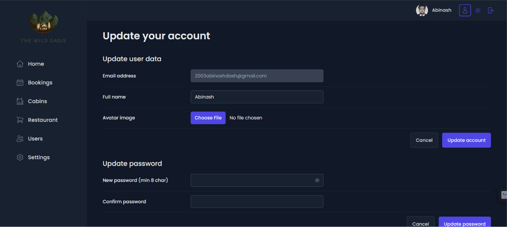</td>
      <td>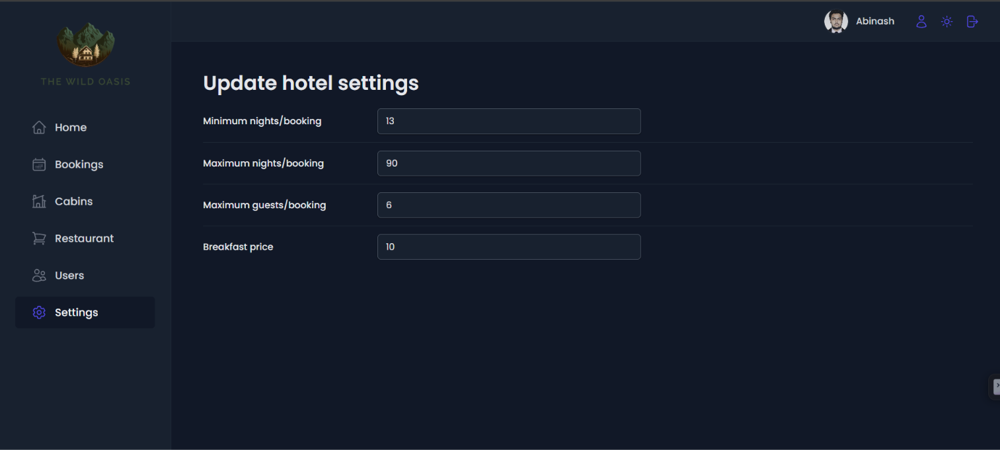</td>
      <td>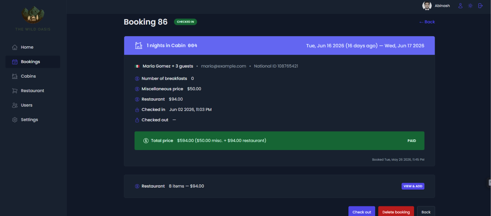</td>
    </tr>
  </table>
</div>

---

## Architecture

```mermaid
flowchart TD

subgraph group_frontend["React SPA"]
  node_main(("main<br/>bootstrap<br/>[main.jsx]"))
  node_app["App router<br/>routing<br/>[App.jsx]"]
  node_layout["App shell<br/>layout<br/>[AppLayout.jsx]"]
  node_protected["Protected route<br/>auth guard<br/>[ProtectedRoute.jsx]"]
  node_pages["Route pages<br/>screens"]
  node_sharedui["Shared UI<br/>design system"]
end

subgraph group_features["Domain features"]
  node_auth["Auth feature<br/>domain module"]
  node_bookings["Bookings feature<br/>domain module"]
  node_cabins["Cabins feature<br/>domain module"]
  node_checkin["Check-in flow<br/>workflow"]
  node_dashboard["Dashboard feature<br/>analytics"]
  node_restaurant["Restaurant feature<br/>workflow"]
  node_invoice["Invoice feature<br/>workflow"]
  node_settings["Settings feature<br/>configuration"]
end

subgraph group_services["API services"]
  node_apiauth["Auth API<br/>supabase client<br/>[apiAuth.js]"]
  node_apibookings["Bookings API<br/>supabase client<br/>[apiBookings.js]"]
  node_apicabins["Cabins API<br/>supabase client<br/>[apiCabins.js]"]
  node_apirestaurant["Restaurant API<br/>supabase client<br/>[apiRestaurant.js]"]
  node_apisettings["Settings API<br/>supabase client<br/>[apiSettings.js]"]
  node_emailsvc["Email service<br/>integration<br/>[emailService.js]"]
end

subgraph group_backend["Supabase backend"]
  node_supabase[("Supabase<br/>backend platform")]
  node_migrations["Migrations<br/>schema/sql"]
  node_edgefx["Edge functions<br/>serverless"]
  node_storage[("Storage<br/>object store")]
end

node_main -->|"bootstraps"| node_app
node_app -->|"renders shell"| node_layout
node_app -->|"guards routes"| node_protected
node_app -->|"routes"| node_pages
node_layout -->|"uses"| node_sharedui
node_pages -->|"uses"| node_auth
node_pages -->|"uses"| node_bookings
node_pages -->|"uses"| node_cabins
node_pages -->|"uses"| node_checkin
node_pages -->|"uses"| node_dashboard
node_pages -->|"uses"| node_restaurant
node_pages -->|"uses"| node_settings
node_bookings -->|"calls"| node_apibookings
node_cabins -->|"calls"| node_apicabins
node_checkin -->|"calls"| node_apibookings
node_dashboard -->|"reads"| node_apibookings
node_restaurant -->|"calls"| node_apirestaurant
node_settings -->|"calls"| node_apisettings
node_auth -->|"calls"| node_apiauth
node_invoice -->|"prepares"| node_emailsvc
node_apiauth -->|"auth"| node_supabase
node_apibookings -->|"data"| node_supabase
node_apicabins -->|"data"| node_supabase
node_apirestaurant -->|"data"| node_supabase
node_apisettings -->|"data"| node_supabase
node_emailsvc -->|"invokes"| node_edgefx
node_invoice -->|"invokes"| node_edgefx
node_supabase -->|"contains"| node_migrations
node_supabase -->|"hosts"| node_edgefx
node_supabase -->|"stores"| node_storage

click node_main "https://github.com/abidev2003/the-wild-oasis/blob/main/src/main.jsx"
click node_app "https://github.com/abidev2003/the-wild-oasis/blob/main/src/App.jsx"
click node_layout "https://github.com/abidev2003/the-wild-oasis/blob/main/src/ui/AppLayout.jsx"
click node_protected "https://github.com/abidev2003/the-wild-oasis/blob/main/src/ui/ProtectedRoute.jsx"
click node_pages "https://github.com/abidev2003/the-wild-oasis/tree/main/src/pages"
click node_sharedui "https://github.com/abidev2003/the-wild-oasis/tree/main/src/ui"
click node_auth "https://github.com/abidev2003/the-wild-oasis/tree/main/src/features/authentication"
click node_bookings "https://github.com/abidev2003/the-wild-oasis/tree/main/src/features/bookings"
click node_cabins "https://github.com/abidev2003/the-wild-oasis/tree/main/src/features/cabins"
click node_checkin "https://github.com/abidev2003/the-wild-oasis/tree/main/src/features/check-in-out"
click node_dashboard "https://github.com/abidev2003/the-wild-oasis/tree/main/src/features/dashboard"
click node_restaurant "https://github.com/abidev2003/the-wild-oasis/tree/main/src/features/restaurant"
click node_invoice "https://github.com/abidev2003/the-wild-oasis/tree/main/src/features/invoice"
click node_settings "https://github.com/abidev2003/the-wild-oasis/tree/main/src/features/settings"
click node_apiauth "https://github.com/abidev2003/the-wild-oasis/blob/main/src/services/apiAuth.js"
click node_apibookings "https://github.com/abidev2003/the-wild-oasis/blob/main/src/services/apiBookings.js"
click node_apicabins "https://github.com/abidev2003/the-wild-oasis/blob/main/src/services/apiCabins.js"
click node_apirestaurant "https://github.com/abidev2003/the-wild-oasis/blob/main/src/services/apiRestaurant.js"
click node_apisettings "https://github.com/abidev2003/the-wild-oasis/blob/main/src/services/apiSettings.js"
click node_emailsvc "https://github.com/abidev2003/the-wild-oasis/blob/main/src/services/emailService.js"
click node_supabase "https://github.com/abidev2003/the-wild-oasis/tree/main/supabase"
click node_migrations "https://github.com/abidev2003/the-wild-oasis/tree/main/supabase/migrations"
click node_edgefx "https://github.com/abidev2003/the-wild-oasis/tree/main/supabase/functions"
click node_storage "https://github.com/abidev2003/the-wild-oasis/tree/main/supabase"

classDef toneNeutral fill:#f8fafc,stroke:#334155,stroke-width:1.5px,color:#0f172a
classDef toneBlue fill:#dbeafe,stroke:#2563eb,stroke-width:1.5px,color:#172554
classDef toneAmber fill:#fef3c7,stroke:#d97706,stroke-width:1.5px,color:#78350f
classDef toneMint fill:#dcfce7,stroke:#16a34a,stroke-width:1.5px,color:#14532d
classDef toneRose fill:#ffe4e6,stroke:#e11d48,stroke-width:1.5px,color:#881337
classDef toneIndigo fill:#e0e7ff,stroke:#4f46e5,stroke-width:1.5px,color:#312e81
classDef toneTeal fill:#ccfbf1,stroke:#0f766e,stroke-width:1.5px,color:#134e4a
class node_main,node_app,node_layout,node_protected,node_pages,node_sharedui toneBlue
class node_auth,node_bookings,node_cabins,node_checkin,node_dashboard,node_restaurant,node_invoice,node_settings toneAmber
class node_apiauth,node_apibookings,node_apicabins,node_apirestaurant,node_apisettings,node_emailsvc toneMint
class node_supabase,node_migrations,node_edgefx,node_storage toneRose
```

### High-Level Overview

```
[React SPA (Vite)]  ←→  [Supabase (Postgres + Auth + Storage)]
         |
         └── [Edge Functions]  ←→  [Resend (Email)]
```

- **Frontend:** Single-page React app. All data fetching via TanStack Query. No server-side rendering.
- **Backend:** Supabase provides the database, authentication, file storage, and serverless edge functions.
- **Email:** Triggered from the frontend via Supabase Edge Functions calling Resend API.
- **Auth:** Supabase Auth handles both email/password and OAuth flows. Session persisted in localStorage.

---

## Tech Stack

| Layer | Technology |
|-------|-----------|
| **Frontend** | React 19 + Vite 8 |
| **Backend** | Supabase (Postgres, Auth, Storage, Edge Functions) |
| **State** | TanStack Query 5 |
| **Styling** | styled-components (responsive layout, mobile-first) |
| **Routing** | react-router 7 |
| **Charts** | Recharts |
| **PDF** | @react-pdf/renderer |
| **Email** | Resend (via Supabase Edge Functions) |
| **Auth** | Supabase Auth (email/password + OAuth) |
| **Forms** | react-hook-form |
| **Icons** | react-icons (Heroicons, Font Awesome, Flat Color) |
| **Deploy** | Netlify |

---

## Key Engineering Decisions

### 1. TanStack Query for Server State

All API calls go through TanStack Query mutations and queries. No global state management library (Redux/Zustand) — server state is cached, synced, and invalidated by TanStack Query. Local UI state (modals, filters) lives in component state or URL search params.

### 2. Supabase as the Entire Backend

No custom backend server. Supabase provides Postgres (with RLS), authentication, file storage for cabin images and avatars, and edge functions for email. This eliminates the need to maintain a separate API server.

### 3. Employee-Gated OAuth

OAuth (Google/GitHub) is login-only. New employees must be created by an admin via the signup form, which inserts into both `auth.users` and the `employees` allowlist table. The `AuthCallback` page verifies the user's email exists in `employees` — unauthorized users are signed out immediately. This prevents random people from self-signing up via OAuth.

### 4. Database Triggers for Price Consistency

Cabin prices, breakfast prices, and restaurant orders all affect the booking's `totalPrice`. Rather than trusting the frontend to always send the correct total, Postgres triggers recalculate prices automatically whenever related data changes. This ensures consistency even if the frontend has bugs or data is modified directly.

### 5. optimistic Updates for Check-in/Check-out

Check-in and check-out use TanStack Query's `onMutate` for immediate UI feedback. The UI updates before the server confirms, with automatic rollback on error.

### 6. styled-components with CSS Custom Properties

Dark mode is implemented via CSS custom properties (variables) toggled at the `:root` level. styled-components references these variables, so switching dark mode requires **zero re-renders** — just a class toggle on the document.

### 7. Invoice as PDF + QR Code

Invoices are generated clientside with `@react-pdf/renderer`. A QR code links to a public `/verify-invoice` page so guests can verify their invoice without logging in. The PDF is uploaded to Supabase Storage and emailed via Resend.

### 8. Email via Edge Functions + Resend

The frontend never calls Resend directly. It invokes Supabase Edge Functions (triggered by TanStack Query mutations), which use the `service_role` key to call the Resend API. This keeps the Resend API key server-side.

---

## Routes

| Path | Page | Description |
|------|------|-------------|
| `/dashboard` | Dashboard | Stats, charts, today's activity |
| `/bookings` | Bookings | Manage all bookings (filter, sort, search, CRUD) |
| `/bookings/:bookingId` | Booking Detail | Single booking view + restaurant orders |
| `/checkin/:bookingId` | Check In | Check-in flow (breakfast, extras, payment) |
| `/cabins` | Cabins | Cabin management with image upload |
| `/users` | Users | Create new staff users (auto-added to `employees`) |
| `/settings` | Settings | Hotel-wide settings (min/max nights, breakfast price) |
| `/account` | Account | Update profile, avatar, password |
| `/restaurant` | Restaurant | Room service orders for checked-in guests |
| `/login` | Login | Email/password + OAuth (Google, GitHub) |
| `/forgot-password` | Forgot Password | Request password reset |
| `/reset-password` | Reset Password | Set new password from recovery link |
| `/auth/callback` | Auth Callback | OAuth redirect handler (validates employee access) |
| `/verify-invoice` | Verify Invoice | Public invoice verification via QR code |
| `*` | 404 | Page not found |

---

## Core Features

### Authentication System

Three authentication methods, all handled by Supabase Auth:

| Method | Flow | Guard |
|--------|------|-------|
| **Email/Password Login** | `signInWithPassword()` | Session check in `ProtectedRoute` |
| **Email/Password Signup** | `signUp()` + auto-insert into `employees` | Only accessible by authenticated users |
| **OAuth (Google/GitHub)** | `signInWithOAuth()` → callback → employee check | `AuthCallback` verifies email in `employees` table |

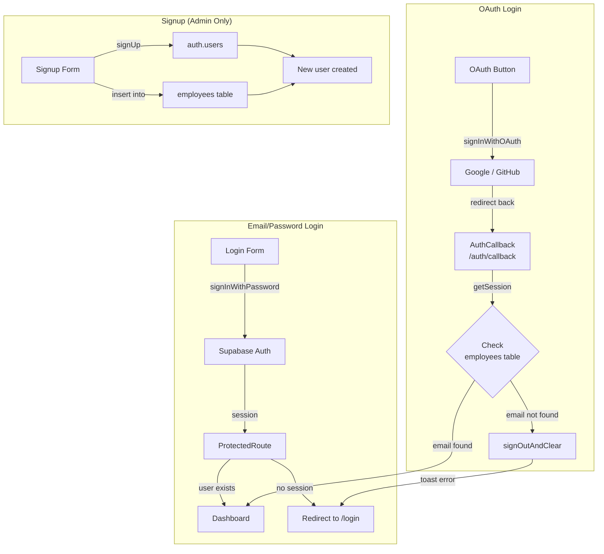

- Password reset uses `resetPasswordForEmail()` with a redirect back to `/reset-password`.
- `ProtectedRoute` wraps all authenticated pages and redirects to `/login` if no session exists.
- `useUser` hook provides the current user globally via React context.
- Session is stored in localStorage by Supabase and persists across refreshes.

### Booking Lifecycle

```
Guest books online (external)
         ↓
  Booking created → status: "unconfirmed"
         ↓
  Staff confirms → status: "confirmed"
         ↓
  Guest arrives → staff checks in → status: "checked-in"
         ↓
  Guest departs → staff checks out → status: "checked-out"
```

- **Auto-cancellation:** A cron job (3 AM daily) cancels unconfirmed bookings whose `startDate` has passed.
- **Stale cleanup:** Unconfirmed bookings older than 48 hours with `startDate` in the past are auto-deleted.
- **Archival:** A 90-day filter hides old check-outs by default.
- **Search:** By booking ID, guest name, email, or cabin name.
- **Pagination:** 10 bookings per page with server-side offset.

### Check-in / Check-out

| Step | Actions |
|------|---------|
| **Check-in** | Verify booking exists → set breakfast count → add miscellaneous charges → confirm payment → update status to checked-in → send check-in email |
| **Check-out** | Calculate final total (cabin + breakfast + miscellaneous + restaurant) → generate invoice PDF with QR → upload PDF to Supabase Storage → send invoice email with attachment → update status to checked-out |

- Payment is confirmed during check-in (no payment gateway integration — assumes cash/card collected at reception).
- Miscellaneous charges cover extras like late checkout, damage fees, or additional services.

### Restaurant (Room Service)

- Displays all currently checked-in guests in a table.
- Staff can add food/drink items to any checked-in guest's bill.
- A **database trigger** (`restaurant_orders_total_update`) automatically recalculates the booking's `totalPrice` whenever a restaurant order is inserted, updated, or deleted.
- A **second trigger** (`ensure_restaurant_in_total_price`) runs `BEFORE UPDATE` on bookings as a safety net, ensuring restaurant orders are always included in the total.
- Restaurant totals appear on the checkout invoice.

### Cabin Management

| Feature | Detail |
|---------|--------|
| CRUD | Create, read, update, delete with modal forms |
| Image upload | Uploads to Supabase Storage (`cabins` bucket) |
| Filter | By discount (all / with discount / no discount) |
| Sort | By name, capacity, price, discount |
| Search | Client-side filtering by cabin name |

### Dashboard

- **Stat cards:** Total bookings, total sales, check-ins today, occupancy rate.
- **Today's activity:** List of guests checking in and out today.
- **Charts:** Sales line chart + stay duration bar chart (Recharts).
- **Date range filter:** Last 7, 30, or 90 days.
- All data computed from the `bookings` table via Supabase queries (no aggregation tables).

### Invoice System

- **Format:** PDF generated clientside with `@react-pdf/renderer`.
- **Contents:** Guest name, cabin details, stay dates, price breakdown (cabin nights, breakfast, miscellaneous, restaurant orders), total.
- **QR code:** Links to `/verify-invoice?bookingId=X` — a public page that displays the invoice for guest verification without requiring login.
- **Delivery:** PDF is uploaded to Supabase Storage, then emailed via a Supabase Edge Function that calls Resend with the PDF attachment.

### Database Triggers

Four Postgres triggers maintain data integrity:

| Trigger | Purpose |
|---------|---------|
| `cabin_price_update` | Recalculates `cabinPrice` and `totalPrice` on existing bookings when a cabin's `regularPrice` or `discount` changes |
| `settings_breakfast_price_update` | Updates `extrasPrice` and `totalPrice` on bookings when the breakfast price in settings changes |
| `restaurant_orders_total_update` | Recalculates `totalPrice` on the related booking when a restaurant order is inserted/updated/deleted |
| `ensure_restaurant_in_total_price` | Safety net: runs BEFORE UPDATE on bookings to ensure restaurant orders are included in `totalPrice` |

All triggers skip checked-out bookings (finalized transactions).

### Auto-Email System

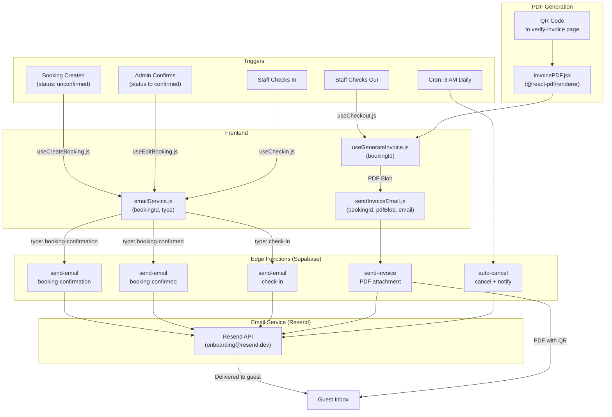

**5 Email Flows:**
| # | Email | Trigger | Edge Function |
|---|-------|---------|---------------|
| 1 | Booking Confirmation | Booking created (unconfirmed) | `send-email` → `booking-confirmation` |
| 2 | Booking Confirmed | Admin confirms (→ confirmed) | `send-email` → `booking-confirmed` |
| 3 | Check-in Confirmation | Staff checks in | `send-email` → `check-in` |
| 4 | Checkout + Invoice PDF | Staff checks out | `send-invoice` (PDF attached) |
| 5 | Auto-Cancellation | Cron: unconfirmed + past startDate | `auto-cancel` → cancels + notifies |

### Dark Mode

- Toggle in the sidebar.
- Persists choice in `localStorage`.
- Respects `prefers-color-scheme` on first visit.
- Implemented via CSS custom properties — switching mode is a single class toggle with zero re-renders.

### Settings

- Minimum nights per booking (default: 1).
- Maximum nights per booking (default: 90).
- Maximum guests per booking (default: 8).
- Breakfast price (used by the `settings_breakfast_price_update` trigger).
- Changes to breakfast price retroactively affect existing non-checked-out bookings via the database trigger.

---

## Environment Variables

| Variable | Description |
|----------|-------------|
| `VITE_SUPABASE_URL` | Supabase project URL |
| `VITE_SUPABASE_KEY` | Supabase anon key |
| `RESEND_API_KEY` | Resend email API key |
| `RESEND_FROM_EMAIL` | Sender email address |

Supabase Edge Functions also use `SUPABASE_URL`, `SUPABASE_SERVICE_ROLE_KEY`, `RESEND_API_KEY`, `RESEND_FROM_EMAIL`, and `RESEND_API_URL` set via `supabase secrets`.

---

## Getting Started

### Prerequisites

- Node.js 18+
- A Supabase account (free tier works)
- (Optional) A Resend account for email features

### Step 1 — Clone & Install

```bash
git clone <repo-url>
cd the-wild-oasis
npm install
```

### Step 2 — Create a Supabase Project

1. Go to [supabase.com](https://supabase.com) and create a new project
2. Once created, go to **Project Settings → API** and copy:
   - `Project URL` → `VITE_SUPABASE_URL`
   - `anon public key` → `VITE_SUPABASE_KEY`

### Step 3 — Set Up Environment Variables

Create a `.env` file in the project root:

```env
VITE_SUPABASE_URL=your_project_url
VITE_SUPABASE_KEY=your_anon_key
```

### Step 4 — Run Migrations

In Supabase Dashboard → **SQL Editor**, run these files in order:

1. `supabase/migrations/001-create-employees-table.sql` — creates the employee allowlist table
2. Backfill existing users (if any):
   ```sql
   INSERT INTO employees (email, full_name)
   SELECT email, raw_user_meta_data->>'fullName'
   FROM auth.users
   ON CONFLICT (email) DO NOTHING;
   ```
3. `supabase/migrations/triggers.sql` — sets up price sync triggers

### Step 5 — Enable OAuth (Optional)

In Supabase Dashboard → **Authentication → Providers**, enable Google and/or GitHub. Add these redirect URLs:

- `http://localhost:5173/auth/callback`
- `https://your-domain.com/auth/callback` (for production)

### Step 6 — Seed Demo Data

You'll need cabins and bookings to use the app. Either:
- Create them manually through the UI after logging in
- Or run your own seed SQL via the Supabase SQL Editor

### Step 7 — Create Your First Employee

Since the signup form is behind authentication, you need to create the first user directly:

1. In Supabase Dashboard → **Authentication → Users → Add User**
2. Enter email + password
3. Then insert them into `employees`:
   ```sql
   INSERT INTO employees (email, full_name) VALUES ('your@email.com', 'Your Name');
   ```

### Step 8 — Start the App

```bash
npm run dev
```

Open `http://localhost:5173` and log in with the credentials you created.

---

### (Optional) Set Up Email

If you want invoice emails and booking notifications:

1. Create a Resend account and get an API key
2. Deploy the Supabase Edge Functions:
   ```bash
   supabase functions deploy send-email
   supabase functions deploy send-invoice
   supabase functions deploy auto-cancel
   ```
3. Set secrets:
   ```bash
   supabase secrets set RESEND_API_KEY=your_key
   supabase secrets set RESEND_FROM_EMAIL=sender@example.com
   ```
